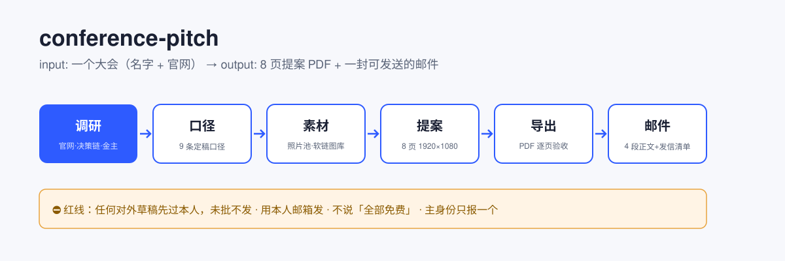

# conference-pitch

[](LICENSE)
[](https://github.com/sethliao/conference-pitch/actions/workflows/validate-skills.yml)
[](https://skills.sh)

> 看到一个想合作的大会，到把提案和邮件发出去——中间隔着一堆 admin work。这个 skill 把这堆事做成了一条流水线。

**[English README](README.en.md)**



## 数字背书（全部来自真实跑通，不是演示数据）

**1 个真实大会**（GOSIM Shenzhen 2026）全流程 → **6 个站** → **8 页提案 PDF**（1920×1080，含报价页 + 置换方案）→ **9 条定稿口径** → **4 段邮件** → **1 张发信清单** → **3 条调研抓取坑**实踩记录。

## 它会给你什么

| 真实处境 | 你会得到 |
|---|---|
| 看到一个想合作的大会，不知道从哪下手 | Phase 0 调研清单：联系通道 / 硬事实 / **决策链（谁拍板）** / 赞助商分级（谁是金主） |
| 提案每次都从头写 | 8 页骨架 + 9 条口径表，换大会只换数据段 |
| 不知道报价怎么开口 | 报价页结构 + **置换在报价之前**的谈判结构（⛔ 不说「全部免费」） |
| 邮件写太长没人看 | 4 段短邮件模板 + 发信清单（只有两个文件：PDF + 正文） |
| 被大会官网反爬/结构坑 | 3 条实测抓取判据（赞助商全在 logo 的 `alt` 里，正文是 0 个） |

## 安装

```bash
# skills CLI
npx -y skills add sethliao/conference-pitch -g --all

# 或 Claude Code 插件
# 把 .claude-plugin 配置加入你的 marketplace 即可
```

## 快速开始

跟你的 agent 说：**「下一个大会是 <大会名>」**。

然后照 [docs/从第一个大会开始.md](docs/从第一个大会开始.md) 走：调研 → 定口径（10 分钟，最值钱的一步）→ 选照片 → 生成提案 → 过目 → **你自己点发送**。

## 这条管线的信条

- **把 admin work 产品化，把审美和发送键留给人。** AI 拼对照表和清单，人选照片、定版式、点发送。
- **置换在报价之前，报价放最后。** 顺序就是谈判结构。
- **主身份只报一个。** 身份并列 = 每个都可信度减半。
- **诚实但不自我贬低。** 「练手」这类词出现一次，议价能力归零——定稿前 grep 清零。
- **旧版归档不删，但标「⛔ 别用」。** 发信清单里永远只有两个文件。

更多实测判据 → [knowledge/判据库.md](knowledge/判据库.md)（18 条，全部来自真实跑通）

## 仓库结构

```
skills/conference-pitch/   主 skill（六站流程 + 红线 · 中英双语）
  templates/               proposal.html（8 页骨架+设计系统）· 口径表 · 邮件正文 · 发信清单（中英）
scripts/                   inject_editor.py（就地编辑层注入：改字/换图/导出PDF）
                           proposal-editor-layer.html（编辑层真源）· export_pdf.sh（导出+逐页验收）
docs/                      场景化入门
knowledge/                 判据库 18 条（中英 · 踩坑 + 谈判结构）
assets/                    管线图
```

⭐ **提案不只是文档，是工具链**：`templates/proposal.html` 起手 → 改内容 → `scripts/inject_editor.py` 注入就地编辑层（浏览器里改字/裁剪换图/链接体检/导 PDF）→ `scripts/export_pdf.sh` 出 PDF + 逐页验收图。

## 作者

**志朋 Seth Liao** — 3D & AI 内容创作者，一人制片厂实践者。

> 「一人之制片，流程先行。」

- GitHub: [@sethliao](https://github.com/sethliao)
- 同系列仓库：[one-person-studio](https://github.com/sethliao/one-person-studio)

## License

[CC BY-NC 4.0](LICENSE) — 非商业使用自由，商业授权请联系作者。
