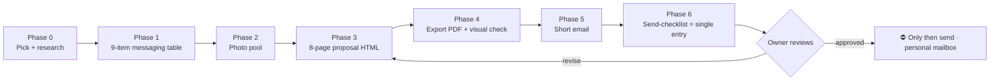

# conference-pitch · Conference Media Partnership Proposal Pipeline

> **One-liner**: Turn "produce on-site content (main film / speaker interviews / photography) for a tech conference in exchange for a media pass + barter + pricing" into a pipeline you can rerun for every conference.
> **Reference implementation**: GOSIM Shenzhen 2026 (full cycle: 8-page proposal PDF + 4-paragraph email + send-checklist). **New conference = rerun Phase 0-6; the skeleton stays, only content swaps.**
> 🇨🇳 中文版：[SKILL.md](SKILL.md)



---

## ⛔ Standing red lines (re-check at every phase)

1. **Every outbound draft is reviewed by the owner first. Nothing sends unapproved.** Mark all artifacts `status: pending owner review · ⛔ NOT SENT`.
2. ⛔ Send from the **owner's personal mailbox**, never an agent/automation address — first contact from an unfamiliar address goes straight to trash.
3. ⛔ Never say "all free" → say "**if a barter works, I'm happy to do it free**" (keeps negotiating room).
4. ⛔ Banned words must be grepped to zero before finalizing (pick ~3 self-deprecating / hand-tipping words per conference; `grep` the whole file before calling it done).
5. ⛔ Round your numbers: "around 7.5K followers", never exact.
6. **One identity only**; every other skill is supporting evidence, **never stacked**.
7. **Taste belongs to the owner**: they pick photos and layouts; the agent only assembles comparisons and checklists.
8. Old versions are **archived, not deleted**, marked "⛔ do not use"; the send-checklist names the single source of truth.

---

## Phase 0 · Pick a conference + research

When they say "next conference" → ask for name and dates; if they have no target, pull 2-3 candidates from their bookmarks/trending and **let them choose**.

Research checklist (scrape the official site):

| Item | What to capture |
|---|---|
| Contact channels | general inbox (support@), separate entries for hackathon / CFP / media pass |
| Hard facts | dates / city / venue / scale numbers (developers, speakers, tracks, workshops) — **verify against the site, never from memory** |
| Decision chain | **who organizes / co-hosts** — **find the person who can say yes > find the "right" person** |
| Sponsor tiers | who pays real money (how many platinum slots, who holds them) → sanity-check your "main pocket" |

🚨 Three field-tested scraping traps:
1. **Sponsor names are not in the page text — they live in logo `alt` attributes.** Parsing visible text gives you "0 sponsors", a false conclusion.
2. **Splitting tiers by character offset is wrong** (sites render in one blob; heading and logos can be tens of thousands of chars apart) → use structural attributes (e.g. `data-filter-category`); ⚠️ never guess attribute names, read the DOM first.
3. **HTTP 200 can be a 404 page** + footer social icons get misread as sponsors → only trust imgs with sponsor styling classes.

---

## Phase 1 · The 9-item messaging table (lock messaging before writing)

Re-confirm every item per conference (template: `templates/口径表.md` / `templates/briefing-table.en.md`): education / languages / timeline / pricing / single identity / barter wording / follower count / salutation / banned words.

> Method: barter before pricing, pricing last, never mention tickets — spell out "what you get" before talking money.

---

## Phase 2 · Photo pool (taste is the owner's; the agent only stages)

```
img/              ← photos used in the current draft (semantic filenames)
img-pool/         ← local candidates
img-pool-gdrive/  ← cloud-drive imports (compressed to 1600px)
```

- **Symlink the library, never copy**: one canonical store, each proposal directory `ln -s` to it; add a photo once and every proposal can pick it.
- ⛔ **Never bulk-import** (hundreds of photos will choke the workflow) — import by collection, top up as needed.
- Add a small caption on the cover photo ("Cover: XX 2024, I'm in this shot") — **prevent it being mistaken for AI-generated**.

---

## Phase 3 · The 8-page proposal HTML (reusable skeleton, swap all content)

**Start by copying `templates/proposal.html`** — the full design system (deep-space black #05070D × electric blue #2E5BFF) + 8-page skeleton. Every `<angle bracket>` is a placeholder; each page carries a comment on its job and what to swap.

| Page | Job | Per-conference changes |
|---|---|---|
| 1 Cover | one-line anchor ("On M/D, when N developers walk in, the content they see — I'll make it.") + identity chips | dates / scale / conference name |
| 2 Four deliverables | main film / speaker interviews / photography / recap — the core page | tune to the conference |
| 3 Three credentials | identity + past events + flagship numbers | generic, mostly untouched |
| 4 ⭐ How the film gets made | duration / aspect / shot sequence — **the strongest page**: real, tested specs | only your own specs, **never name who you tore down** |
| 5 Timeline | "after we agree" timeline, not capability adjectives | swap dates |
| 6 ⭐ Barter offer | content on their official channels, fully licensed | swap channel names |
| 7 ⭐ Pricing | itemized table + day-rate highlight | mostly untouched |
| 8 Needs + contact | media pass / shooting permit / identity note + contacts | ⛔ no tickets, no sponsorship asks |

Technical notes:
- **Page size**: `.page{width:1920px;height:1080px}` + `@page{size:1920px 1080px;margin:0}` — 16:9, doubles as slide logic.
- 🚨 Footer is `position:absolute` on `.page` — new pages must include it; page numbers are hand-written.
- ⭐ **In-place editor (revise without touching source)**: `python3 scripts/inject_editor.py <proposal.html>` (idempotent) — then open in a browser to ✏️ edit text, 🖼 click any image to crop/swap (drag-crop + brightness/opacity/blur sliders + library sidebar + upload), 🔗 link health-check (warns when visible text ≠ href), ⬇️ export PDF, ⬇️ download a self-contained revised file. Changes live in localStorage first — **only "download revised version" overwrites the source**. The layer's single source is `scripts/proposal-editor-layer.html` (marked CSS+JS blocks; upgrade by swapping this one file).

---

## Phase 4 · Export PDF + visual acceptance

```bash
bash scripts/export_pdf.sh <proposal.html> [output.pdf]
# = headless Chrome → PDF + pdftoppm per-page renders into pdf-check/
```

- ⛔ **Exit code 0 ≠ layout intact.** Always inspect page renders (`pdftoppm -r 96 -png`) one by one.
- ⛔ **Never validate by "split pages into single HTMLs and screenshot"** — splitting breaks CSS inheritance and everything is a false alarm.

---

## Phase 5 · The email (short!)

**Shorter is better** (the reference implementation is 4 paragraphs); all detail lives in the attached PDF. Template: `templates/邮件正文.md` / `templates/email-body.en.md`:

1. One-paragraph intro (messaging #1/#2/#5 + one line why them)
2. "Attached is my proposal"
3. Ask for a receipt + offer the next deliverable ("I can send a detailed shooting plan by <date>")
4. An off-ramp ("If it doesn't fit this time, no worries at all — I'll still be there")
5. Contact block (⛔ never from memory — pull from your canonical profile)

- Subject format: `<Conference> · I'd like to contribute (8-page content & barter proposal attached, to the organizing team)`
- **Also produce** a plain-text version (select-all copy) + an annotatable version.

---

## Phase 6 · Send-checklist (the single entry point)

Template: `templates/发信清单.md` / `templates/send-checklist.en.md`. Rules:

- **Only two files**: the PDF attachment + the body. **Everything else is stale.**
- List every old version marked "⛔ do not use" (archive, don't delete).
- 8-page structure table + the three key designs (one identity / barter before pricing / zero self-deprecation).
- `status: pending owner review · ⛔ NOT SENT` — **until the owner approves, this page is the finish line.**

---

## 📌 Reference implementation: GOSIM Shenzhen 2026 (the numbers behind the README)

- Input: conference name + website → output: **8-page proposal PDF** (1920×1080, pricing + barter pages) + **4-paragraph email** + **1 send-checklist**
- 3 scraping traps hit and documented (see Phase 0), 9 messaging items locked, 3 banned words grepped to zero
- Pricing structure: **barter (P6) before pricing (P7)**; day-rate highlighted, 8 itemized rows
- Email is 4 paragraphs: intro / attachment / receipt request / off-ramp
