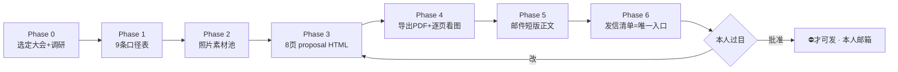

# conference-pitch · 大会媒体合作提案全流程

> **一句话**：把「为技术大会做现场内容（主片/讲师拆解/摄影）换媒体证 + 置换 + 报价」这套提案，从一个大会复制到下一个大会。
> **参考实现**：GOSIM Shenzhen 2026（全流程跑通：8 页提案 PDF + 4 段邮件 + 发信清单）。**换大会 = 重走 Phase 0-6，骨架不动，只换内容。**



---

## ⛔ 全程红线（每阶段都要回头对照）

1. **任何对外草稿先过本人，未批不发。** 产物一律标 `status: 待本人过目 · ⛔ 未发`。
2. ⛔ 用**本人常用邮箱**发，不用智能体/自动化邮箱——对方看到陌生地址，第一次接触不合适。
3. ⛔ 不说「全部免费」→ 只说「**如果置换可行，我愿意免费做**」（留谈判空间）。
4. ⛔ 禁用词清零后才算定稿（每届大会定 3 个左右自我贬低/泄漏底牌的词，定稿前 `grep` 一遍全文）。
5. ⛔ 数字写约数：粉丝数「约 7.5K」，不写太具体。
6. **主身份只报一个**；其余技能是能力证明，**不并列**。
7. **审美归本人**：照片亲手选、版式本人定；AI 只拼对照表和清单。
8. 旧版**归档不删**，但标「⛔ 别用」，发信清单里写清哪个是唯一真源。

---

## Phase 0 · 选定大会 + 调研

他说「下一个大会」→ 先问大会名和时间；没有目标时从他的收藏/榜单里找 2-3 个候选**让他挑**。

调研清单（抓官网）：

| 项 | 要拿到 |
|---|---|
| 联系通道 | 通用邮箱（support@ 类）、黑客松/CFP/媒体证各自的入口 |
| 硬事实 | 日期 / 城市 / 场地 / 规模数字（开发者、讲师、分论坛、工作坊数）——**按官网复核，不凭印象** |
| 决策链 | **承办方 / 联合发起方是谁**——**找能拍板的人 > 找对的人** |
| 赞助商分级 | 谁是真金主（白金席位有几家、是谁）→ 判断「主打口袋」对不对 |

🚨 抓赞助商的三条实测坑：
1. **页面正文里没有赞助商名字——全在 logo 的 `alt` 属性里**，只解析 visible text 会得到「0 个」假结论。
2. **按字符位置切分级是错的**（站点集中渲染，标题和 logo 可能差几万字符）→ 用结构属性（如 `data-filter-category`）；⚠️ 属性名别猜，先读 DOM。
3. **HTTP 200 可能是 404 页** + 页脚社交图标会被误认成赞助商 → 只认带 sponsor 样式类的 img。

---

## Phase 1 · 九条口径表（先定口径再动笔）

每换一个大会逐条重新确认（模板见 `templates/口径表.md`）：学历表述 / 语言 / 时间表 / 报价 / 主身份 / 置换口径 / 粉丝数 / 收件人抬头 / 禁用词。

> 方法论：置换放报价前、报价放最后、不提门票——先把「你能得到什么」讲清楚，再谈钱。

---

## Phase 2 · 照片素材池（审美归本人，AI 只搭台）

```
img/              ← 当前稿子用的图（每张有语义文件名）
img-pool/         ← 本地候选池
img-pool-gdrive/  ← 云盘导入的候选（压到 1600px）
```

- **图库用软链不复制**：真身只存一份，各提案目录 `ln -s` 过去；换图往真身里加一次，所有提案立刻都能选到。
- ⛔ **别全量导入**（几百张会卡死工作流）——按集挑选导入，要更多再补。
- 封面照片右下角加一行小批注（「封面照片：XX 2024 现场，我在其中」）——**防对方误认 AI 生成**。

---

## Phase 3 · Proposal 8 页 HTML（骨架可复用，内容全换）

8 页骨架（每页的作用）：

| 页 | 作用 | 换大会时 |
|---|---|---|
| 1 封面 | 一句话锚（「N 月 N 日，N 位开发者进场时，看到的那套内容，我来做。」）+ 身份 chips | 换日期/规模数字/大会名 |
| 2 四件交付 | 主片 / 讲师拆解 / 摄影 / 盘点——核心页 | 按大会特点微调 |
| 3 三条凭证 | 身份 + 过往现场 + 代表作数据 | 通用，基本不动 |
| 4 ⭐ 主片怎么做 | 时长/画幅/镜头顺序——**最强一页**：报得出实测规格 | 只讲自己的规格，**不提拆解过谁** |
| 5 排期表 | 「合作确定后」的时间线，不是能力形容词 | 换大会日期 |
| 6 ⭐ 置换方案 | 内容挂对方官方渠道，完全授权 | 换对方渠道名 |
| 7 ⭐ 报价 | 分项价格表 + 单日全包价突出 | 基本不动 |
| 8 需求+联系 | 媒体证/拍摄许可/身份说明 + 联系表 | ⛔ 不提门票赞助 |

技术要点：
- **页面尺寸**：`.page{width:1920px;height:1080px}` + `@page{size:1920px 1080px;margin:0}` —— 16:9，同时是 PPT 逻辑。
- 🚨 页脚用 `position:absolute` 挂在 `.page` 上——新页记得带，页码手写。
- 可做一个「就地编辑层」（contenteditable + 换图 + 导出 PDF），改稿不用回源码。

---

## Phase 4 · 导出 PDF + 验收

```bash
"/Applications/Google Chrome.app/Contents/MacOS/Google Chrome" --headless --no-sandbox --disable-gpu \
  --no-pdf-header-footer --print-to-pdf="proposal.pdf" "file://$PWD/index.html"
```

- ⛔ **命令不报错 ≠ 排版没崩**。出完必须逐页看图：`pdftoppm -r 96 -png proposal.pdf /tmp/page` → 逐页看。
- ⛔ **别用「单页拆分 HTML 再截图」验证法**——拆页断 CSS 继承，会误报排版崩了。

---

## Phase 5 · 邮件正文（短版！）

**正文越短越好**（参考实现只有 4 段），详细内容全在附件 PDF。模板见 `templates/邮件正文.md`：

1. 自介一段（口径表 #1/#2/#5 + 一句为什么找你们）
2. 「附件是我做的提案」
3. 回执请求 + 给出下一步交付物（「X 日前可以补更细的拍摄计划」）
4. 台阶句（「如果这次不合适，也完全没关系——我依然会在现场」）
5. 联系表（⛔ 不凭印象写，从档案真源取）

- 主题行格式：`<大会名> · 想为大会做点贡献（附 8 页内容与置换方案，致主办方与大会团队）`
- **同时产出**纯文本版（直接全选复制）+ 可批注版。

---

## Phase 6 · 发信清单（唯一入口）

模板见 `templates/发信清单.md`。要点：

- **只有两个文件**：附件 PDF + 正文。**别的都是旧的**。
- 旧版路径全部列出并标「⛔ 别用」（归档不删原则）。
- 8 页结构表 + 三个关键设计（主身份只报一个 / 置换在报价前 / 自我贬低词清零）。
- `status: 待本人过目 · ⛔ 未发` —— **本人批准前，这页就是终点**。

---

## 📌 参考实现：GOSIM Shenzhen 2026（数字背书）

- 输入：大会名 + 官网 → 输出：**8 页提案 PDF**（1920×1080，含报价页与置换方案）+ **4 段邮件** + **1 张发信清单**
- 调研阶段实踩 3 条抓取坑（见 Phase 0），口径表定稿 **9 条**，禁用词 **3 个**全篇 grep 清零
- 报价结构：**置换方案（P6）在报价（P7）之前**；单日全包价绿色突出，分项 8 行
- 邮件只 4 段：自介 / 附件 / 回执请求 / 台阶句
